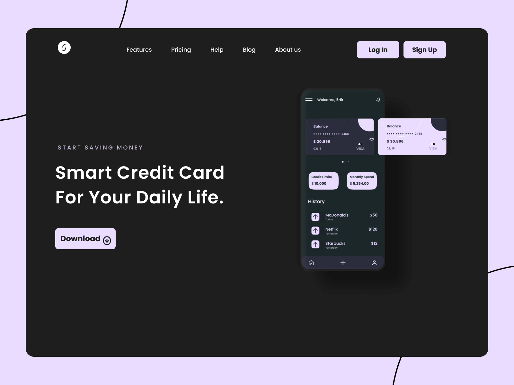

## Payment LP

Working on a React project was an exciting way to gain hands-on experience with the popular JavaScript library. It has a component-based architecture and virtual DOM that make it a powerful tool for creating dynamic and interactive web apps. This project allowed me to delve deeper into React's concepts, improve my front-end skills, and enhance my understanding of modern web development practices, while adding to my portfolio.

- React
- React Hooks
- Styled Components

